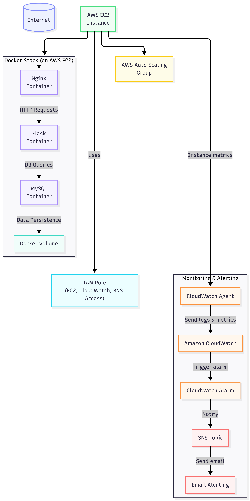
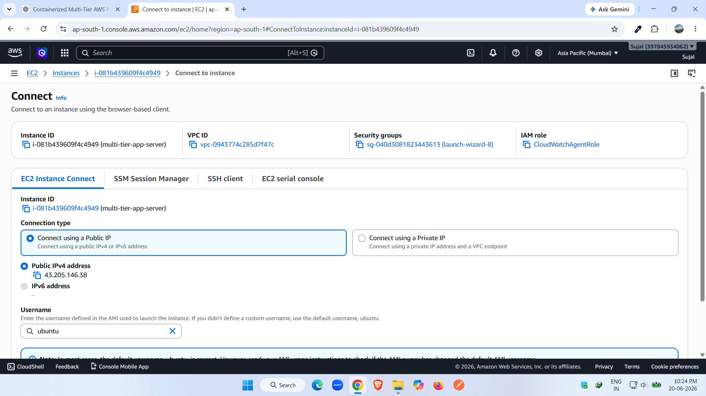
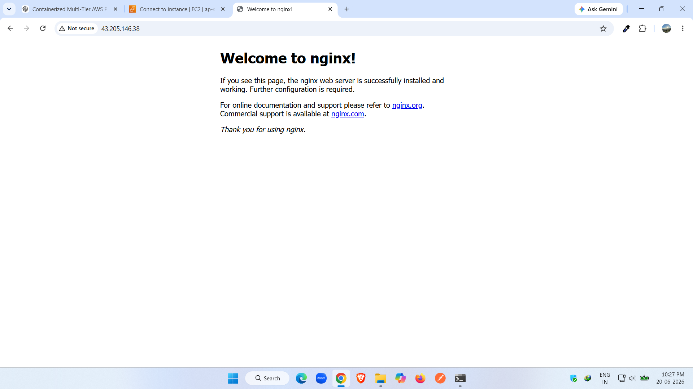
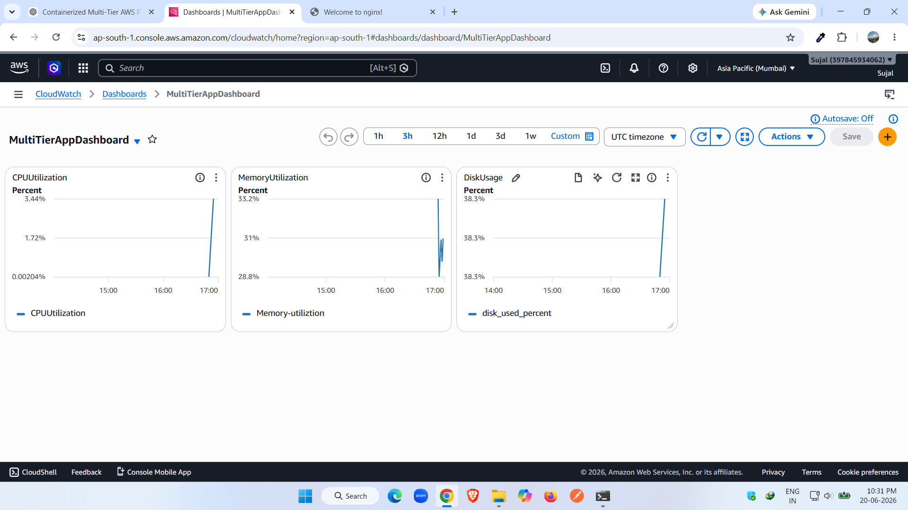
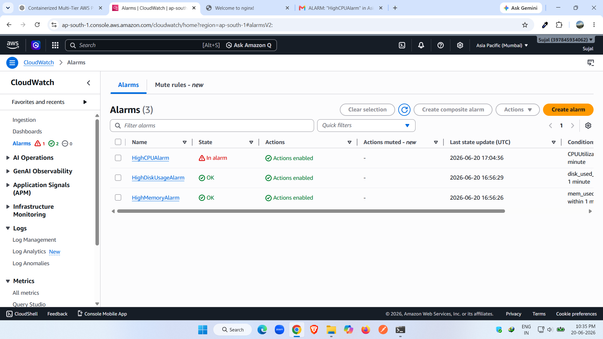
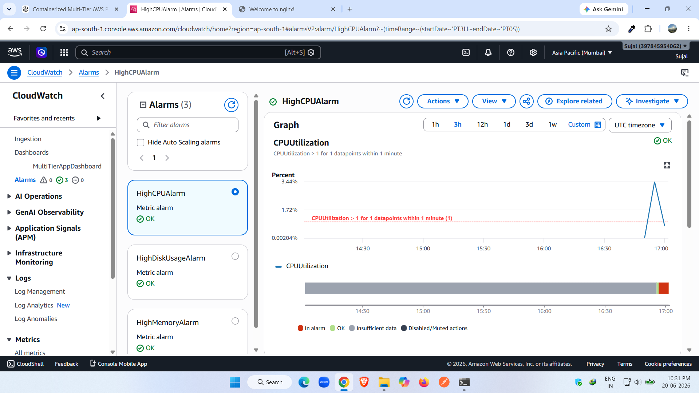
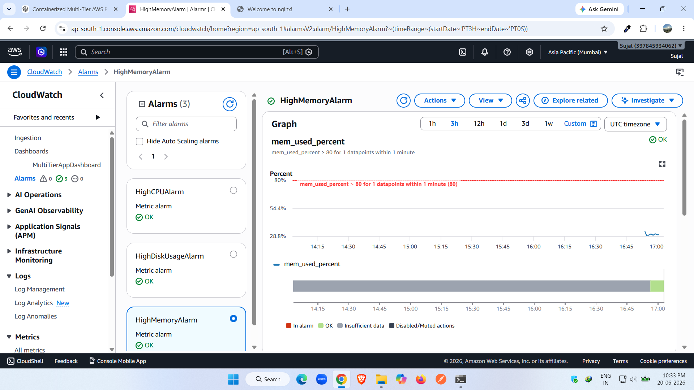
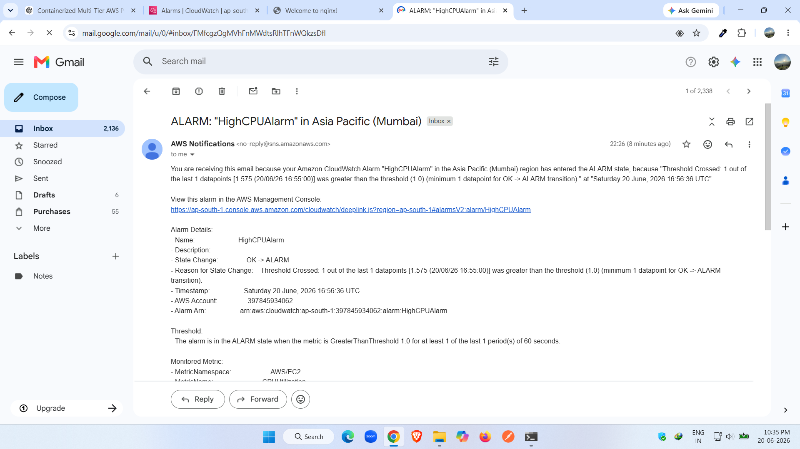

# 🚀 Containerized Multi-Tier AWS Monitoring & Alerting Platform

<p align="center">
  
  
  
  
  
</p>

<p align="center">
  <b>Enterprise-Style Infrastructure Monitoring Project built on AWS</b>
</p>

---

# 📖 Project Overview

The solution deploys a containerized workload on an Amazon EC2 instance and continuously monitors:

✅ CPU Utilization

✅ Memory Usage

✅ Disk Usage

✅ Docker Host Health

✅ Cloud Infrastructure Metrics

✅ Incident Alerts via Email

---

# 🏗️ Solution Architecture

<p align="center">
  
</p>

---

# 🛠️ Technologies Used

| Category   | Technology           |
| ---------- | -------------------- |
| Cloud      | AWS EC2              |
| Monitoring | CloudWatch           |
| Alerting   | SNS                  |
| Containers | Docker               |
| OS         | Ubuntu Linux         |
| Security   | IAM                  |
| Metrics    | CPU, Memory, Disk    |
| Dashboard  | CloudWatch Dashboard |

---

# ✨ Features

### Infrastructure Monitoring

* Real-time CPU Monitoring
* Real-time Memory Monitoring
* Real-time Disk Monitoring

### Incident Alerting

* CPU Threshold Alerts
* Memory Threshold Alerts
* Disk Threshold Alerts
* Email Notifications

### Visualization

* CloudWatch Dashboard
* Performance Graphs
* Resource Tracking

### Troubleshooting

* Agent Health Validation
* Alarm Testing
* Incident Simulation

---

# 📊 CloudWatch Dashboard

The dashboard provides centralized visibility into infrastructure health.

Widgets Included:

* CPU Utilization
* Memory Utilization
* Disk Utilization
* Alarm Status

---

# 🚨 CloudWatch Alarms

| Alarm              | Threshold |
| ------------------ | --------- |
| HighCPUAlarm       | > 70%     |
| HighMemoryAlarm    | > 80%     |
| HighDiskUsageAlarm | > 80%     |

Actions:

* SNS Notification
* Email Alert

---

# 🧪 Testing Performed

## CPU Alarm Test

```bash
stress --cpu 2 --timeout 300
```

Expected Result:

* CPU increases
* Alarm triggers
* Email notification received

---

## Memory Monitoring Test

Verified:

```text
mem_used_percent
```

CloudWatch Agent successfully publishes memory metrics.

---

## Disk Monitoring Test

Verified:

```text
disk_used_percent
```

CloudWatch Agent successfully publishes disk metrics.

---

# 📸 Project Screenshots

Create a folder:

```text
Screenshots/
```

Add:

### 1. EC2 Instance Running

<p align="center">
  
</p>

### 2. Website Running

<p align="center">
  
</p>

### 3. CloudWatch Dashboard

<p align="center">
  
</p>

### 4. Alarm Triggered

<p align="center">
  
</p>

### 5. CPU Alarm Triggered

<p align="center">
  
</p>

### 6. Memory Alarm

<p align="center">
  
</p>

### 7. Disk Alarm

<p align="center">
  
</p>

### 8. SNS Email Notification

<p align="center">
  
</p>

---

# 🎯 Skills Demonstrated

### AWS

* EC2
* IAM
* CloudWatch
* SNS

### Linux

* Package Management
* Service Management
* Monitoring

### Docker

* Container Installation
* Container Management

### Monitoring & Operations

* Incident Detection
* Alerting
* Infrastructure Monitoring
* Performance Analysis


# 📜 Author

**Sujal Parmar**

